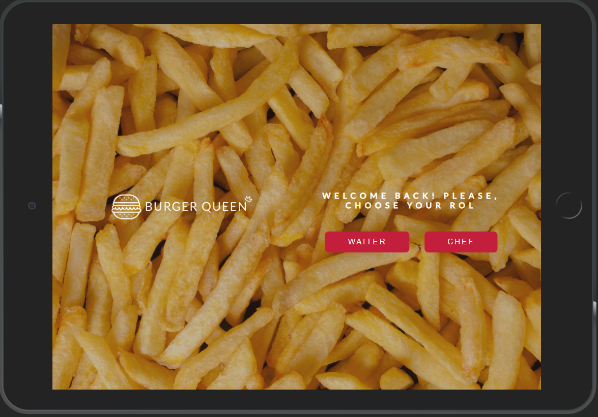
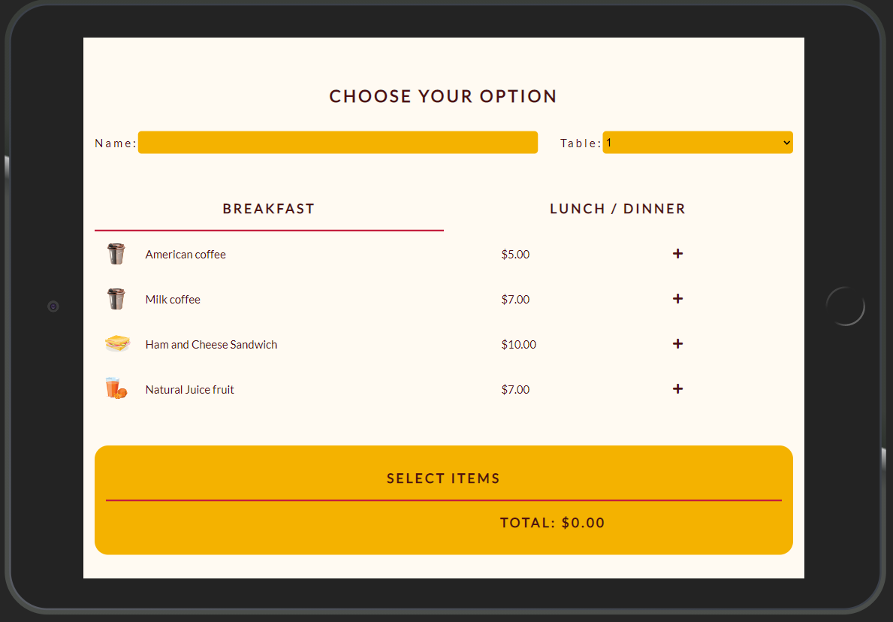
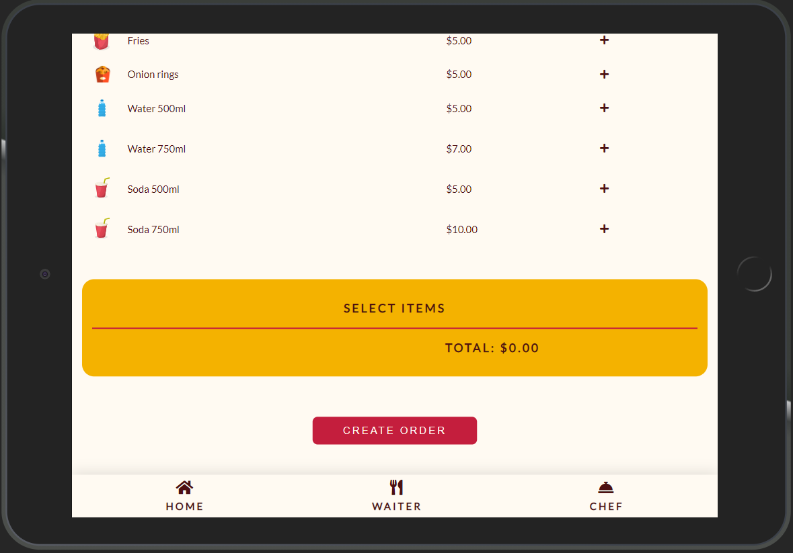
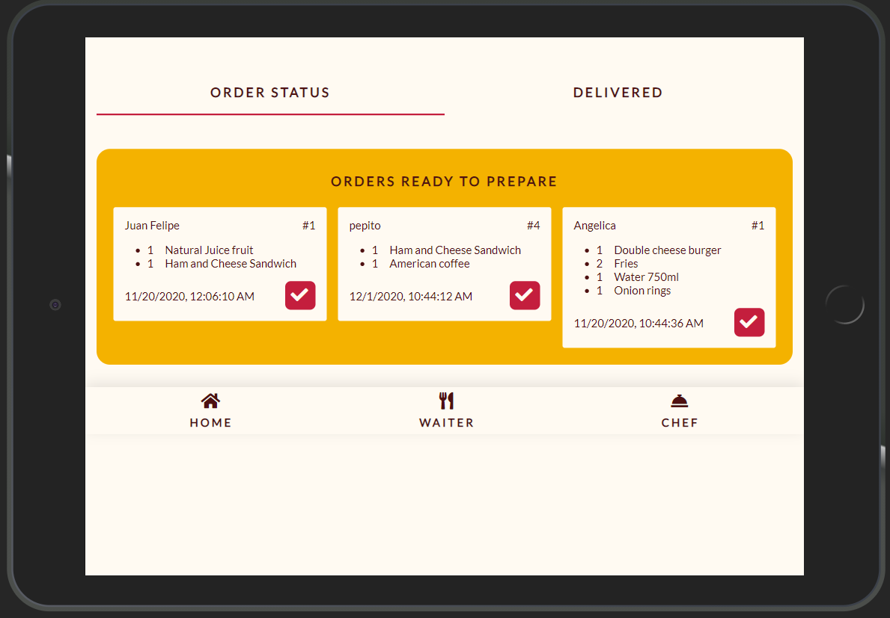
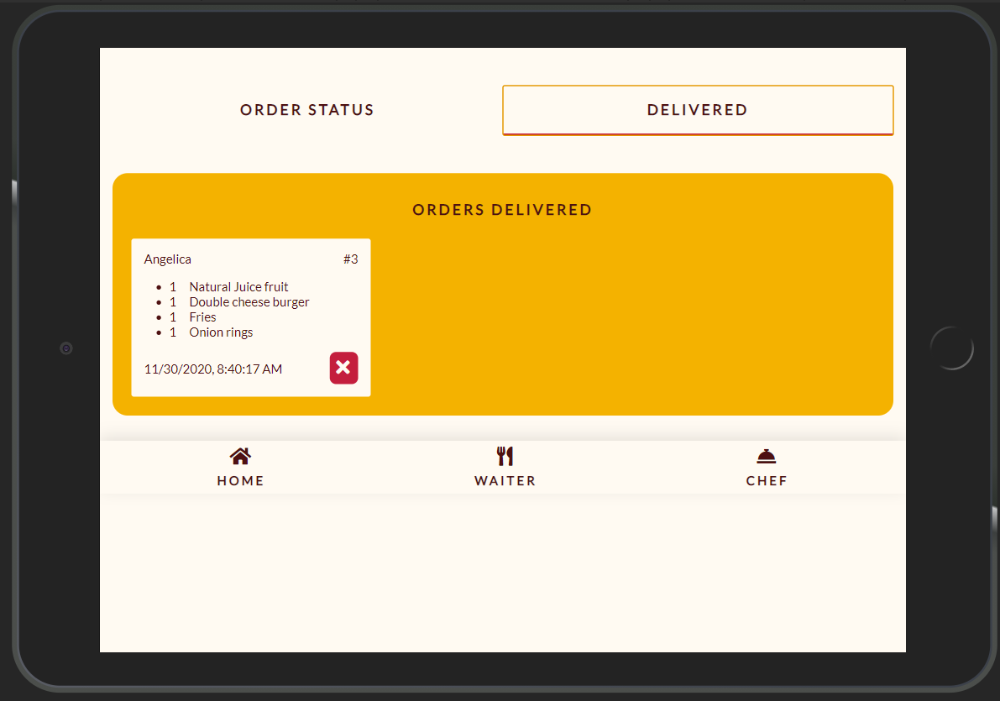

# Burger Queen

  

## Resumen del proyecto

Esta vez tenemos un proyecto 100% por encargo. Si bien siempre puedes (y debes)
hacer sugerencias de mejoras y/o cambios, muchas veces trabajarás en proyectos
en los que primero hay que asegurarse de cumplir con lo requerido.

Un pequeño restaurante de hamburguesas, que está creciendo, necesita una
interfaz en la que puedan tomar pedidos usando una _tablet_, y enviarlos
a la cocina para que se preparen ordenada y eficientemente.

Esta es la información que tenemos del cliente:

> Somos **Burguer Queen**, una cadena de comida 24hrs.
>
> Nuestra propuesta de servicio 24hrs ha tenido muy buena acogida y, para
> seguir creciendo, necesitamos un sistema que nos ayude a tomar los pedidos de
> nuestros clientes.
>
> Tenemos 2 menús: uno muy sencillo para el desayuno:
>
> | Ítem                      |Precio $|
> |---------------------------|------|
> | Café americano            |    5 |
> | Café con leche            |    7 |
> | Sandwich de jamón y queso |   10 |
> | Jugo de frutas natural              |    7 |
>
> Y otro menú para el resto del día:
>
> | Ítem                      |Precio|
> |---------------------------|------|
> |**Hamburguesas**           |   **$**   |
> |Hamburguesa simple         |    10|
> |Hamburguesa doble          |    15|
> |**Acompañamientos**        |   **$**   |
> |Papas fritas               |     5|
> |Aros de cebolla            |     5|
> |**Para tomar**             |   **$**   |
> |Agua 500ml                 |     5|
> |Agua 750ml                 |     7|
> |Bebida/gaseosa 500ml       |     7|
> |Bebida/gaseosa 750ml       |     10|
>
> 

### PROTOTIPOS DE ALTA FIDELIDAD

 

## Objetivos de aprendizaje

El objetivo principal de este proyecto es aprender a construir una _interfaz web_
usando el _framework_ elegido (React, Vue o Angular). Todos estos frameworks de
Front-end atacan el mismo problema: **cómo mantener la interfaz y el estado sincronizados**.
Así que esta experiencia espera familiarizarte con el concepto de _estado de pantalla_,
y cómo cada cambio sobre el estado se va a ir reflejando en la interfaz (por ejemplo,
cada vez que agregamos un _producto_ a un _pedido_, la interfaz debe actualizar
la lista del pedido y el total).

A continuación puedes ver los objetivos de aprendizaje de este proyecto:

### HTML y CSS

* [X] [Uso de HTML semántico.](https://developer.mozilla.org/en-US/docs/Glossary/Semantics#Semantics_in_HTML)
* [X] Uso de selectores de CSS.
* [X] Construir tu aplicación respetando el diseño realizado (maquetación).
* [X] [Uso de flexbox en CSS.](https://css-tricks.com/snippets/css/a-guide-to-flexbox/)
* [X] [Uso de Media Queries.](https://developer.mozilla.org/es/docs/CSS/Media_queries)

### JavaScript

* [X] Uso de condicionales (if-else | switch | operador ternario)
* [X] Uso de funciones (parámetros | argumentos | valor de retorno)
* [X] Manipular arrays (filter | map | sort | reduce)
* [X] Manipular objects (key | value)
* [X] Uso ES modules ([`import`](https://developer.mozilla.org/en-US/docs/Web/JavaScript/Reference/Statements/import)
| [`export`](https://developer.mozilla.org/en-US/docs/Web/JavaScript/Reference/Statements/export))
* [X] Diferenciar entre expression y statements.
* [X] Diferenciar entre tipos de datos atómicos y estructurados.
* [X] [Uso de callbacks.](https://developer.mozilla.org/es/docs/Glossary/Callback_function)
* [X] [Consumo de Promesas.](https://scotch.io/tutorials/javascript-promises-for-dummies#toc-consuming-promises)

### Testing

* [X] [Testeo unitario.](https://jestjs.io/docs/es-ES/getting-started)

### Estructura del código y guía de estilo

* [X] Organizar y dividir el código en módulos (Modularización)
* [X] Uso de identificadores descriptivos (Nomenclatura | Semántica)
* [X] Uso de linter (ESLINT)

### Git y Github

* [X] Uso de comandos de git (add | commit | pull | status | push)
* [X] Manejo de repositorios de GitHub (clone | fork | gh-pages)
* [X] Colaboración en Github (branches | pull requests | |tags)
* [X] Organización en Github (projects | issues | labels | milestones)

### Firebase

* [X] [Firestore.](https://firebase.google.com/docs/firestore)
* [ ] [Firebase Auth.](https://firebase.google.com/docs/auth/web/start)
* [X] [Firebase security rules.](https://firebase.google.com/docs/rules)
* [X] Observadores. ([onAuthStateChanged](https://firebase.google.com/docs/auth/web/manage-users?hl=es#get_the_currently_signed-in_user)
 | [onSnapshot](https://firebase.google.com/docs/firestore/query-data/listen#listen_to_multiple_documents_in_a_collection))

### React

* [ ] [`JSX`](https://es.reactjs.org/docs/introducing-jsx.html)
* [X] [Componentes `class` y componentes `function`](https://es.reactjs.org/docs/components-and-props.html#function-and-class-components)
* [X] `props`
* [X] [Eventos en React.](https://es.reactjs.org/docs/handling-events.html)
* [X] [Listas y keys.](https://es.reactjs.org/docs/lists-and-keys.html)
* [X] [Renderizado condicional.](https://es.reactjs.org/docs/conditional-rendering.html)
* [X] [Elevación de estados.](https://es.reactjs.org/docs/lifting-state-up.html)
* [X] [`hooks`](https://es.reactjs.org/docs/hooks-intro.html)
* [X] [`CSS` modules.](https://create-react-app.dev/docs/adding-a-css-modules-stylesheet)
* [X] [React Router.](https://reacttraining.com/react-router/web)

### UX

* [X] Diseñar la aplicación pensando y entendiendo al usuario.
* [X] Crear prototipos para obtener feedback e iterar.
* [X] Aplicar los principios de diseño visual (contraste, alineación, jerarquía)
* [X] Planear y ejecutar tests de usabilidad.
#### [Historia de usuario 1] Mesero/a debe poder tomar pedido de cliente

Yo como meserx quiero tomar el pedido de un cliente para no depender de mi mala
memoria, para saber cuánto cobrar, y enviarlo a la cocina para evitar errores y
que se puedan ir preparando en orden.

##### Criterios de aceptación

Lo que debe ocurrir para que se satisfagan las necesidades del usuario)

* Anotar nombre de cliente.
* Agregar productos al pedido.
* Eliminar productos.
* Ver resumen y el total de la compra.
* Enviar pedido a cocina (guardar en alguna base de datos).
* Se ve y funciona bien en una _tablet_

##### Definición de terminado

Lo acordado que debe ocurrir para decir que la historia está terminada.

* Debes haber recibido _code review_ de al menos una compañera.
* Haces _test_ unitarios y, además, has testeado tu producto manualmente.
* Hiciste _tests_ de usabilidad e incorporaste el _feedback_ del usuario.
* Desplegaste tu aplicación y has etiquetado tu versión (git tag).

#### [Historia de usuario 2] Jefe de cocina debe ver los pedidos

Yo como jefx de cocina quiero ver los pedidos de los clientes en orden y
marcar cuáles están listos para saber qué se debe cocinar y avisar a lxs meserxs
que un pedido está listo para servirlo a un cliente.

##### Criterios de aceptación

* Ver los pedidos ordenados según se van haciendo.
* Marcar los pedidos que se han preparado y están listos para servirse.
* Ver el tiempo que tomó prepara el pedido desde que llegó hasta que se
  marcó como completado.

##### Definición de terminado

* Debes haber recibido _code review_ de al menos una compañera.
* Haces _test_ unitarios y, además, has testeado tu producto manualmente.
* Hiciste _tests_ de usabilidad e incorporaste el _feedback_ del usuario.
* Desplegaste tu aplicación y has etiquetado tu versión (git tag).

***

#### [Historia de usuario 3] Meserx debe ver pedidos listos para servir

Yo como meserx quiero ver los pedidos que están preparados para entregarlos
rápidamente a los clientes que las hicieron.

##### Criterios de aceptación

* Ver listado de pedido listos para servir.
* Marcar pedidos que han sido entregados.

##### Definición de terminado

* Debes haber recibido _code review_ de al menos una compañera.
* Haces _test_ unitarios y, además, has testeado tu producto manualmente.
* Hiciste _tests_ de usabilidad e incorporaste el _feedback_ del usuario.
* Desplegaste tu aplicación y has etiquetado tu versión (git tag).
* Los datos se deben mantener íntegros, incluso después de que un pedido ha
  terminado. Todo esto para poder tener estadísticas en el futuro.

***

